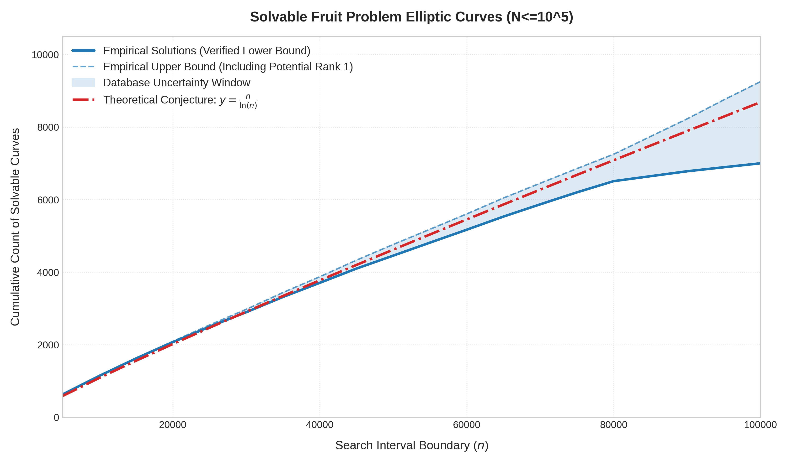

# fruit-problem
A search pipeline and database for elliptic curves isomorphic to the fruit problem equation

## What this project computes
This project computes the generators of the family of elliptic curves

$$
y^2=x^3+(4n^2+12n-3)x^2+32(n+3)x
$$

thus providing non-trivial solutions to the fruit problem

$$
\frac{a}{b+c}+\frac{b}{a+c}+\frac{c}{a+b}=n
$$

## How is data computed
- PARI/GP `ellrank` ([cubic.gp](cubic.gp)) is applied to those curves first.
- For those curves where `ellrank` cannot determine the rank, Magma's higher descents ([cubic_descent.m](cubic_descent.m)) are used.
- When the conductor is small, and analytic calculation is cheap, PARI/GP `ellheegner` is used to compute the generators.
- Refer to [methods.md](methods.md) for more detailed information regarding descents.
- For some Rank $1$ curves whose generators cannot be found, local solubility check is performed so some $n$ can be confirmed to not have any positive integer solutions. Refer to ([rank_counter.py](rank_counter.py)) for more detailed information.
- Navigate to the `100000` branch for data up to $n=10^5$

## Aggregate results

### Graph

It can be shown that the density of solvable Fruit Problem equations scale cleanly with $\frac{n}{\ln n}$. This shows a potential connection to the distribution of primes.

### Rank distribution
| Rank | $n\le 10^4$ | $n\le 10^5$ |
|-:|:-:|:-:|
|$0$|$4304$|$45003$|
|$1$|$4970$|$49662$|
|$2$|$691$|$5089$|
|$3$|$35$|$241$|
|$4$|$0$|$5$|
|$\ge 5$|$0$|$0$|

### Number of curves that generates positive integer solutions
| Rank | $n\le 10^4$ | $n\le 10^5$ |
|-:|:-:|:-:|
|$0$|$0$|$0$|
|$1$|$896+[0,1]$|$7001+[0,2252]$|
|$2$|$226$|$1397$|
|$3$|$19$|$82$|
|$4$|$0$|$2$|
|$\ge 5$|$0$|$0$|

## File Structure
- [cubic.gp](cubic.gp): PARI/GP engine for rank bounds, isogeny mappings, and solution transformations.
- [cubic_descent.m](cubic_descent.m): Magma script for higher-degree descents.
- [cubic_db.txt](cubic_db.txt): The compiled dataset for $N \in [1,10^4]$.
- [compress_point.cpp](compress_point.cpp): A script for compressing and decompressing the database. The dataset in the repo is compressed by this program.

## License
- **Code:** GPL-3.0
- **Dataset:** CC-BY-4.0
